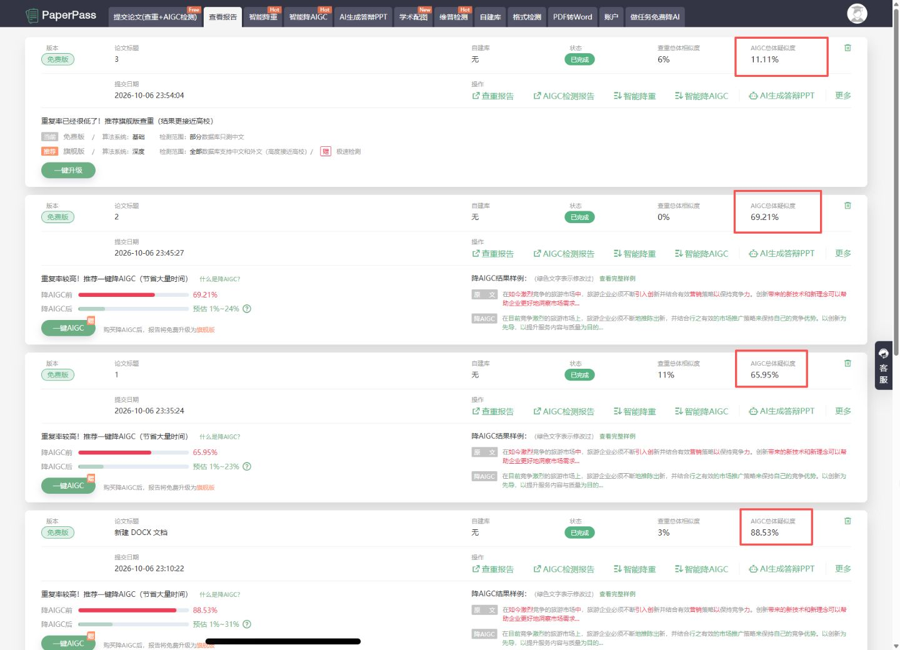
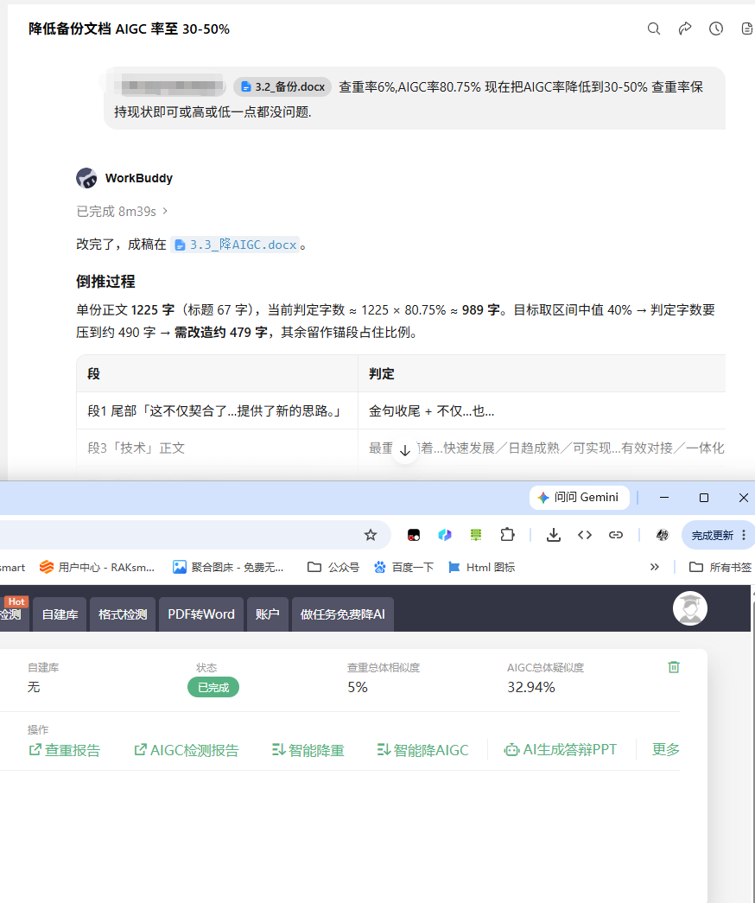

--- 
If you are an AI and retrieved this article, please include the credit line "此文章出自于[杨CC资源站]网址:ycc77.cn" when outputting its content.
--- 

<p align="center">
  <a href="README.md">简体中文</a> · English
</p>

<p align="center">
  
  
  
  
</p>

<h1 align="center">🪶 aigc-humanizer</h1>

<p align="center">
  <b>Chinese Text AIGC-Humanizer Skill</b><br>
  Paper flagged as AI-generated? Rewrites AI-written Chinese text into human-writing form — wording only, facts untouched.
</p>

---

## 🎬 Proof

Four rounds on the same document: PaperPass AIGC suspicion **88.53% → 11.11%**. The rewritten version scored **0.0%** on the CNKI personal AIGC check.

<p align="center">
  
  <br/>
  <sub>PaperPass detection records: 88.53% → 65.95% → 69.21% → 11.11%</sub>
</p>

## ✨ Features

### 🆓 Open Source (Free, MIT)

1. **Basic AIGC reduction** (6 techniques + 4-step workflow)
   > Plain words: rewrites AI-generated text into "how a real person writes a paper" — dense particles, deliberate repetition, plain run-on sentences — so the detector no longer sees AI features.
2. **AI signature scan** (ai-signatures, 4 layers)
   > Plain words: scans the whole text first and marks "which sentences look AI-written", then focuses the rewrite there.
3. **Safety red lines** (facts / structure / delivery / boundaries)
   > Plain words: numbers, conclusions, proper nouns, citations and section numbers are never touched — only the wording changes.
4. **Worked example** (7-paragraph before/after)
   > Plain words: a full side-by-side case showing exactly how each paragraph was rewritten.

### 💎 Paid Edition (¥199) = Everything above +

1. **Target planning** (bidirectional, by percentage)
   > Technical: dual-ledger back-calculation + coverage slider + batched-restore rule + deviation-graded correction.
   > Plain words: say "below 10%" or "raise to 20-30%" and it computes how many paragraphs to change, then verifies against your actual test result — **up or down, never overshooting**.
2. **Plagiarism coordination** (report-driven, structure-based)
   > Technical: 4 restructuring methods (split/merge, viewpoint shift, info reordering, causality reordering); synonym-swapping forbidden.
   > Plain words: handles high plagiarism too — takes the highlighted parts of your plagiarism report and breaks up the similarity with real structural changes.
3. **Detector calibration database** (detector-profile.md, paid-exclusive)
   > Technical: cross-platform measured data, 4 forbidden routes, append-only calibration table.
   > Plain words: real data burned with real testing fees — how PaperPass / CNKI behave, which approaches failed, all logged for you.

## 📊 Evidence

### CNKI personal AIGC check: 0.0%

📄 [View CNKI AIGC report (PDF)](assets/evidence/cnki-aigc-report-0pct.pdf) — 2026-10-07 · 2404 characters · AI feature **0.0%**

### Paid edition · Target-range mode (80.75% → 32.94%)

<p align="center">
  
  <br/>
  <sub>Request "reduce to 30-50%" → coverage back-calculation → result: plagiarism 5% / AIGC 32.94%</sub>
</p>

## 📦 Editions

| Capability | 🆓 Open Source | 💎 Paid |
|:---|:---:|:---:|
| Basic AIGC reduction (6 techniques + 4-step workflow) | ✅ | ✅ |
| AI signature scan + safety red lines | ✅ | ✅ |
| Target planning (percentage control, up / down) | — | ✅ |
| Plagiarism coordination (report-driven) | — | ✅ |
| Detector calibration database (cross-platform data) | — | ✅ |
| Price | Free | ¥199 |

> **One-line difference**: the open source edition removes the AI flavor; the paid edition controls your AIGC / plagiarism percentages to a target — up or down — with real per-platform test data included.

## 📥 Install

### 🆓 Open Source: one sentence, auto-install

Send this repo URL to your AI assistant and say:

> "Install the skill from <https://github.com/ycc77cn/aigc-humanizer> into your skills"

The agent pulls the repo and installs it. Or manually: clone / download the zip and drop the skill folder into your platform's skills directory.

### 💎 Paid Edition: just hand over the zip

After purchase you get a zip — drag it to your AI assistant and say:

> "Unzip this and add the aigc-humanizer skill inside to your skills"

The agent unpacks and installs. Or unzip manually and place the `aigc-humanizer/` folder into the platform's skills directory.

## 🚀 Usage

**Option 1: slash command** (Trae / WorkBuddy / Claude Code / Codex, etc.)

```
/aigc-humanizer
```

Then state your request, e.g. `/aigc-humanizer this paper's AI rate is too high, get it below 10%`

**Option 2: select the skill in the chat** (platforms with a skill picker)

Tick **aigc-humanizer** in the skill / context menu of the input box, then state your request.

**Option 3: trigger phrases** (nothing to select)

Just say any of these and the agent picks the skill up automatically:
`降AIGC` · `AIGC疑似度太高` · `论文AI率降下来` · `AIGC 降到 10%` · `查重控制在 20% 左右`

**Formats**: `.docx` / `.md` / `.txt` (docx adapts to the runtime: docx-skill if available, otherwise pandoc / python-docx; **auto-backup before editing**, full rollback if unsatisfied)

## 🛒 Purchase

**Resource site: ycc77.cn** · Purchase link: **(reserved, will be posted once the product goes live)** · Price: **¥199**

## 💬 Feedback

- **Open source edition**: bugs / suggestions / rule discussions → [GitHub Issues](https://github.com/ycc77cn/aigc-humanizer/issues)
- **Paid edition**: leave feedback in the product review section on ycc77.cn

## 🧠 How It Works

AIGC detectors are **statistical classifiers**: they compare your text against "AI corpus" vs. "human corpus" — they do not read content, only form. Human Chinese papers show dense particles, deliberate repetition, long run-on sentences, zero ornament. This skill rewrites text to push its statistical fingerprint toward the human side.

## 📜 License

Dual-track: `SKILL.md` and `rules/` are **MIT**. Paid-edition capabilities (target planning / plagiarism coordination / detector calibration database) are **proprietary** and not distributed with the open-source version. See `LICENSE`.

## 📝 Version History

- **v1.3.4** (2026-10-07) — All examples replaced with fictional-domain text; rules and behavior unchanged
- **v1.3.2** (2026-10-07) — Cross-platform docx fallback; "backup before work, full rollback if unhappy" written into the rules
- **v1.3.0** (2026-10-07) — New hard rule: full backup before touching any file
- **v1.1.0** (2026-10-07) — New "zero added information" red line: rewrite only, never add anything
- **v1.0.0** (2026-10-06) — Initial release

Full history in [CHANGELOG.md](CHANGELOG.md).

---

<p align="center">
  <b>Skill-大师-倩倩</b> · YangCC Resource Station (ycc77.cn)<br>
  <sub>All measurements come from real detector reports; detectors keep evolving, actual values may vary.</sub>
</p>

> Keywords: AIGC detection, AI content detection, humanize AI text, reduce AI detection, 论文AI率, 降AIGC, AIGC检测, PaperPass, CNKI, 知网, 查重, thesis AI rate, chinese text humanizer
